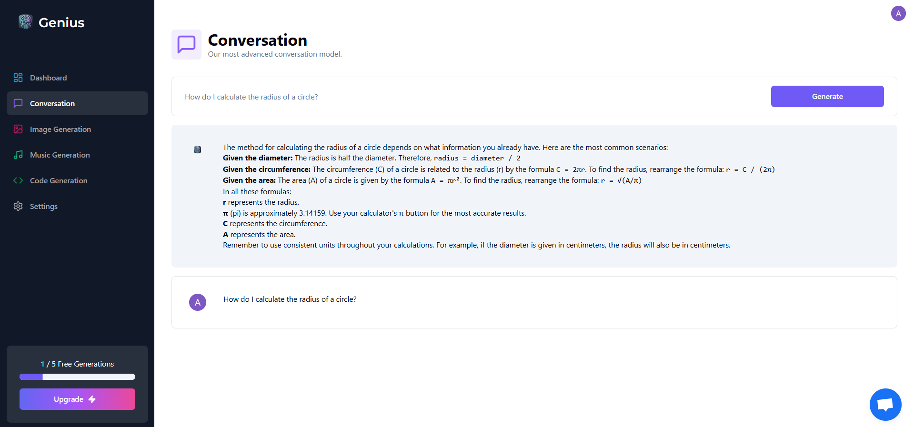
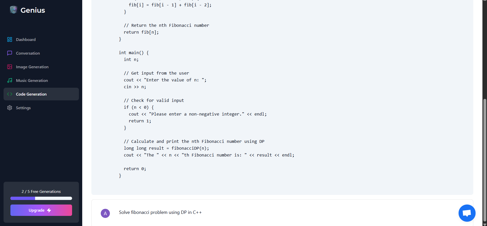
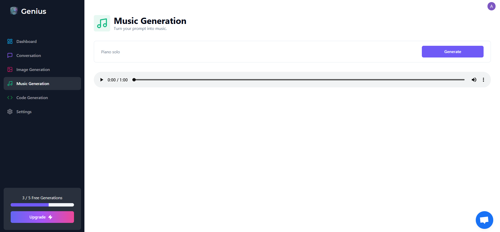

# 🌟 Genius - Multi-Modal AI SaaS Platform

**Your all-in-one AI companion for chat, code, images, and music generation**  
[](https://ai-companion-ecru.vercel.app) 


A full-stack SaaS platform integrating **4 AI engines** into a single seamless experience, powered by Gemini, Pollinations AI, and Beatoven APIs.

<div align="center">
  
   
  
</div>

---

## ✨ Key Features

| Module          | Capabilities                          | Tech Used          |
|-----------------|---------------------------------------|--------------------|
| **AI Chat**     | Context-aware conversations           | Gemini Pro         |
| **Code Gen**    | Code snippets & explanations          | Gemini Pro         |
| **Image Gen**   | Text-to-image creation                | Pollinations AI    |
| **Music Gen**   | AI-composed audio clips               | Beatoven AI        |
| **Core**        | Auth, Payments, Database              | Clerk, Stripe, MongoDB |

**Enterprise-Ready**:  
✔ User authentication (Clerk)  
✔ Subscription payments (Stripe)  
✔ Real-time customer support (Crisp)  
✔ CI/CD deployed on Vercel  

---

## 🛠 Tech Stack

**Frontend**:  
 
 
  

**Backend**:  
 
  
  

**Services**:  
  
  
  

---

## 🚀 Quick Start

1. **Clone the repo**
   ```bash
   git clone https://github.com/anshul45-github/ai-companion.git
   cd ai-companion
   ```

2. **Install dependencies**
   ```bash
   npm install
   ```

3. **Configure environment**  
   Rename `.env.example` to `.env.local` and add your keys:
   ```env
   NEXT_PUBLIC_CLERK_PUBLISHABLE_KEY=pk_test_...
   CLERK_SECRET_KEY=sk_test_...

   NEXT_PUBLIC_CLERK_SIGN_IN_URL=/sign-in
   NEXT_PUBLIC_CLERK_SIGN_UP_URL=/sign-up
   NEXT_PUBLIC_CLERK_AFTER_SIGN_IN_URL=/dashboard
   NEXT_PUBLIC_CLERK_AFTER_SIGN_UP_URL=/dashboard

   GEMINI_API_KEY=your_gemini_api_key_here

   BEATOVEN_AI_API_KEY=your_beatoven_ai_api_key_here

   DATABASE_URL="mongodb+srv://..."

   STRIPE_API_KEY=sk_test_...

   NEXT_PUBLIC_APP_URL=http://localhost:3000

   STRIPE_WEBHOOK_SECRET=whsec_...

   NEXT_PUBLIC_CRISP_ID="your_crisp_id_here"
   ```

4. **Run locally**
   ```bash
   npm run dev
   ```
   Open [http://localhost:3000](http://localhost:3000)

---

## 📂 Directory Structure

```
ai-companion/
├── .next/
├── app/
│   ├── (auth)/
│   ├── (landing)/         # Landing page (unprotected)
│   ├── (dashboard)/       # User portal (protected)
│   ├── api/               # AI service routes
│   │   ├── code/          # Gemini code generation endpoint
│   │   ├── conversation/  # Gemini chat endpoint
│   │   ├── image/         # Pollinations AI handler
│   │   └── music/         # Beatoven API wrapper
│   │   ├── stripe/
│   │   ├── webhook/
│   ├── favicon.ico
│   ├── globals.css
│   ├── layout.tsx
├── components/            # Reusable UI (BotAvatar, Loader)
├── hooks/
├── lib/
│   ├── api-limit.ts
│   ├── prismadb.ts        # Prisma client
│   ├── stripe.ts          # Stripe configs
│   ├── subscription.ts
│   └── utils.ts     
├── node_modules/
├── prisma/
├── public/               # Static assets
├── .env
├── .gitignore
├── components.json
├── constants.ts
├── eslint.config.mjs
├── middleware.ts
├── next-env.d.ts
├── next.config.ts
├── package-lock.json
├── package.json
├── postcss.config.mjs
├── README.md
├── tailwind.config.ts    # Global tailwind config
└── tsconfig.json         
```

---

## 🤝 Contributing

1. Fork the project  
2. Create your branch (`git checkout -b feature/AmazingFeature`)  
3. Commit changes (`git commit -m 'Add feature'`)  
4. Push (`git push origin feature/AmazingFeature`)  
5. Open a Pull Request  

---

> **Note**: This project uses third-party APIs (Gemini, Beatoven). Ensure you comply with their usage policies.  
> For questions, contact [anshulmendiratta10d@gmail.com](mailto:anshulmendiratta10d@gmail.com).
